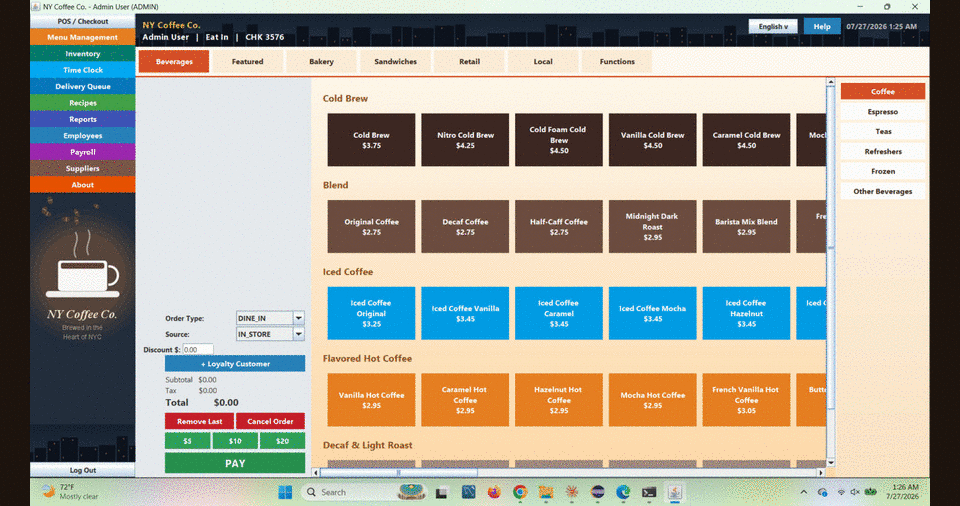
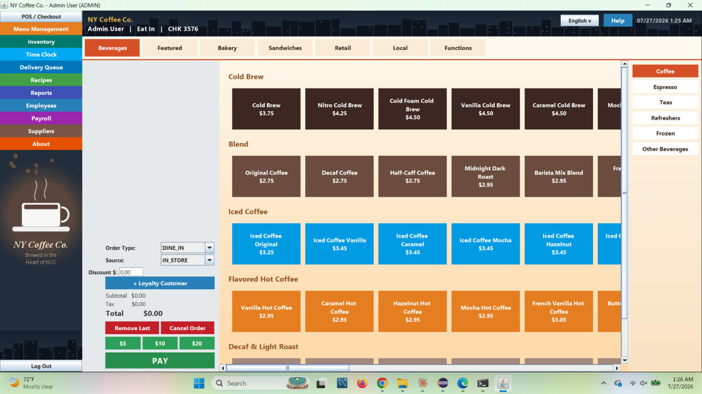
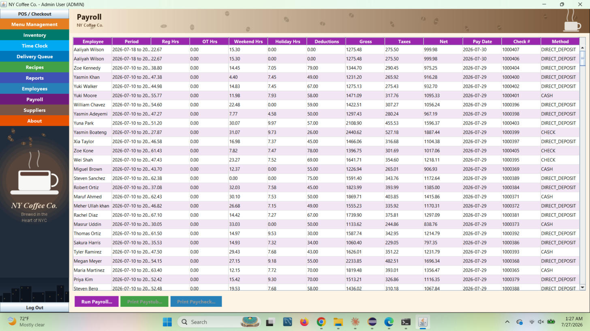
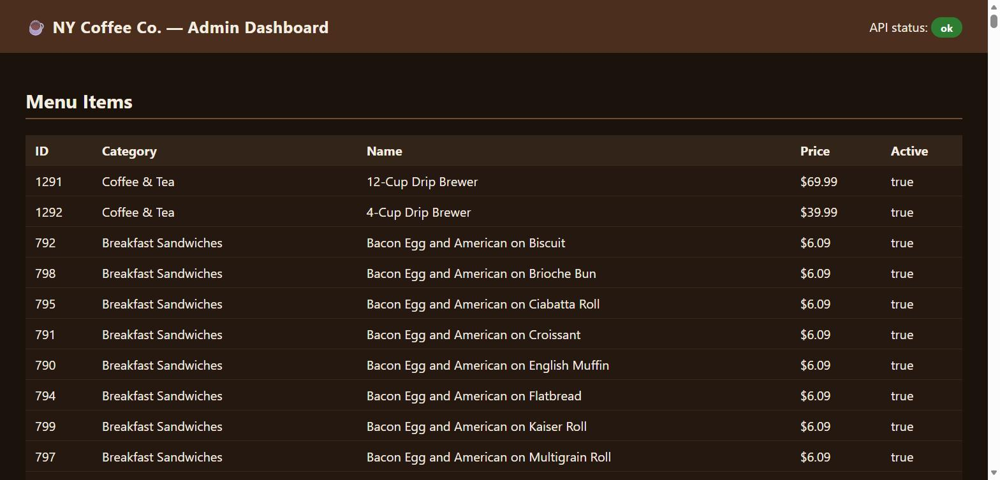

# NY Coffee Co. — Point of Sale System

A full-featured, coffee-shop-branded point-of-sale application built with Java Swing and MySQL. It covers the counter (order entry, customization, payments, loyalty) as well as the back office (inventory, payroll, HR, delivery, suppliers, reporting) in a single desktop app styled after a real-world NYC POS terminal.


[](https://github.com/REZAULKARIM2024/NY-Coffee-Co.-Point-of-Sale-System/actions/workflows/ci.yml)


## Table of Contents

- [Overview](#overview)
- [Screenshots](#screenshots)
- [Features](#features)
- [Tech Stack](#tech-stack)
- [Prerequisites](#prerequisites)
- [Installation](#installation)
- [Configuration](#configuration)
- [Running the Application](#running-the-application)
- [Default Login](#default-login)
- [Project Structure](#project-structure)
- [Database Overview](#database-overview)
- [Seed / Utility Scripts](#seed--utility-scripts)
- [Testing](#testing)
- [Test Architecture: Tagging & Parallel Execution](#test-architecture-tagging--parallel-execution)
- [Code Coverage (JaCoCo)](#code-coverage-jacoco)
- [Test Reporting (Allure)](#test-reporting-allure)
- [BDD & E2E Testing (Cucumber, Selenium)](#bdd--e2e-testing-cucumber-selenium)
- [REST API](#rest-api)
- [Web Admin Dashboard](#web-admin-dashboard)
- [Running with Docker](#running-with-docker)
- [CI/CD Pipeline](#cicd-pipeline)
- [Test Strategy](#test-strategy)
- [Manual QA Validation Reports](#manual-qa-validation-reports)
- [Known Simplifications](#known-simplifications)
- [Roadmap](#roadmap)
- [Contributing](#contributing)
- [License](#license)
- [Contact](#contact)

## Overview

NY Coffee Co. POS is a single-store terminal application: a cashier logs in, rings up orders from a department-tabbed menu (Beverages, Featured, Bakery, Sandwiches, Retail, Local), takes payment (cash, card, gift card, or split tender), and the system handles everything downstream — inventory deduction, order source/type tracking, delivery queueing, and loyalty points — inside atomic database transactions. Managers and admins get additional screens for staffing, payroll, purchasing, and reporting.

## Screenshots



| POS / Checkout | Payroll |
|---|---|
|  |  |

**Web Admin Dashboard** ([more on this below](#web-admin-dashboard)):



## Features

### Point of Sale
- Department-tabbed menu grid (Beverages, Featured, Bakery, Sandwiches, Retail, Local) with a subcategory sidebar, mirroring a real counter-service POS layout.
- Per-item customization screen: size (Small/Medium/Large/Extra Large, each with its own price delta), hot/iced, dairy & sweetener options, flavor swirls, and add-ons — all priced from the `sizes` / `modifiers` tables and summed live.
- Cart with discount entry, live subtotal/tax/total, and order type (Dine In / Pickup / Delivery) + source (In Store / Phone / Online) selectors.
- **Payments screen**: on-screen keypad, Credit Card / CASH / Gift Card Redeem.
  - Cash sales require the cashier to key in what the customer handed over; the app validates it covers the total and automatically calculates and displays **change due**.
  - **Split tender**: if the cash handed over falls short, the app offers to charge the remaining balance to a credit card in the same transaction, recording both legs as separate payment records against the order.
- **Customer loyalty program**: look up or register a customer by phone, +1 point per order, and at 50 points the cheapest cart item is automatically comped and points reset.
- Barcode entry, gift card redemption flow, and a full **Functions** tab covering manager/cashier operations: drawer paid-in/paid-out/cash pull/no-sale, till assignment & counting, safe management, order adjustments, price overrides, manual credit entries, and phone/DT/OTG order handling.

### Back Office
- **Menu Management** — add/edit items, pricing, cost, and availability.
- **Inventory** — live stock levels with low-stock flagging, manual adjustments (purchase-in/waste/correction) with a full audit trail.
- **Time Clock** — clock in/out per employee; managers see a live feed of recent punches.
- **Payroll** — pick an employee and pay period; hours are pulled from time clock punches and split into regular/overtime/weekend/holiday buckets, with federal, Social Security, Medicare, state, and city tax withholding calculated automatically. Every completed run can generate:
  - an itemized **paystub** (earnings, deductions, YTD totals) with a print dialog, and
  - a bank-check-style **paycheck** (with amount spelled out in words) with its own print dialog.
- **Delivery Queue** — orders marked for delivery drop into a queue; drivers get assigned, mark picked up, and mark delivered.
- **Recipes** — numbered prep steps per menu item, per language, for staff training and consistency.
- **Reports** — live sales, tax, and discount totals plus top items by revenue, alongside deeper financial/sales/employee reports under Functions.
- **Employees** — manage staff records and create their POS logins.
- **Suppliers** — manage vendor contacts for purchasing and restocking.
- **About** — company info, leadership profile, mission & vision, and live at-a-glance stats pulled from the database.

### Platform
- Role-based access (ADMIN / MANAGER / CASHIER) with SHA-256 + salt authentication.
- 5-language support (English, Bangla, Hindi, Spanish, French) with an in-app language switcher and help dialog.
- NYC-themed branding throughout (skyline art, coffee-shop illustration, color-coded navigation per section).

## Tech Stack

| Layer | Technology |
|---|---|
| Language | Java 17 |
| UI | Java Swing |
| Database | MySQL 8.x |
| DB Driver | MySQL Connector/J 9.7.0 |
| Printing | `java.awt.print` (native OS print dialog) |
| Build/IDE | Maven (standard `src/main/java` + `src/test/java` layout), imports cleanly into Eclipse |
| Testing | JUnit 5 (Jupiter), run via Maven Surefire (`mvn test`) or the vendored command-line path (`run_tests.bat`) |
| BDD | Cucumber 7 (`cucumber-java` + `cucumber-junit-platform-engine`), Gherkin feature files against the REST API |
| UI Automation | Selenium WebDriver 4 + WebDriverManager, headless Chrome, against the `/admin` dashboard |
| Test Reporting | Allure (`allure-maven` + `allure-junit5`), generated from `mvn test allure:report` |
| REST API | `com.sun.net.httpserver.HttpServer` (JDK built-in), hand-rolled JSON — no external framework |
| Web Admin UI | Static HTML/vanilla JS dashboard (`src/main/resources/webapp/index.html`), served by `ApiServer` at `/admin` |
| CI/CD | GitHub Actions (`.github/workflows/ci.yml`) — MySQL service container, full test suite, Allure report artifact |
| Code Coverage | JaCoCo, scoped to unit-tested classes, enforced via a quality gate on `mvn verify` |
| Containerization | Docker Compose (`docker-compose.yml`) — MySQL + API server, one-command local spin-up |

## Prerequisites

- JDK 17 or later
- MySQL Server 8.x
- Maven 3.8+ (for `mvn test`, dependency-managed builds, and Allure reports) — optional; the app itself and the vendored test path have zero external dependencies
- An IDE (Eclipse recommended) or a plain `javac`/`java` toolchain
- Windows, macOS, or Linux (batch launcher scripts are Windows-specific; other platforms can run the compiled classes/Maven directly)

## Installation

1. **Clone the repository**
   ```bash
   git clone <this-repo-url>
   cd ny-coffee-pos
   ```

2. **Install MySQL and load the schema**
   ```bash
   mysql -u root -p < database/schema.sql
   ```
   This creates the `pos_system` database with categories, menu items, sizes/modifiers, and supporting sample data.

3. **Get the MySQL connector.** The driver jar is already vendored under `lib/mysql-connector-j-9.7.0/`. To use a different version, download it from https://dev.mysql.com/downloads/connector/j/ and update the classpath references.

4. **Import into your IDE.** In Eclipse: File → Import → Existing Projects into Workspace → select this folder, then add `lib/mysql-connector-j-9.7.0/.../mysql-connector-j-9.7.0.jar` to the build path (right-click project → Build Path → Configure Build Path → Libraries → Add JARs).

## Configuration

Set your database credentials in `src/main/java/com/possystem/config/DBConnection.java`:

```java
DB_URL      = "jdbc:mysql://localhost:3306/pos_system"
DB_USER     = "root"
DB_PASSWORD = "<your password>"
```

## Running the Application

- **From an IDE:** run `com.possystem.Main` as a Java Application.
- **From the command line (Windows):** double-click or run `run_app.bat`, which compiles/launches with the classpath already wired to `target/classes` and the MySQL driver.
- **From the command line (manual):**
  ```bash
  javac -d target/classes -cp lib/mysql-connector-j-9.7.0/mysql-connector-j-9.7.0/mysql-connector-j-9.7.0.jar $(find src -name "*.java")
  java -cp "target/classes;lib/mysql-connector-j-9.7.0/mysql-connector-j-9.7.0/mysql-connector-j-9.7.0.jar" com.possystem.Main
  ```

## Default Login

No user is seeded by default. Create your first admin account by hashing a password with the built-in utility and inserting the row yourself:

```bash
java -cp target/classes com.possystem.util.PasswordUtil admin123
```

This prints a `Salt` and `Hash`. Insert your admin row:

```sql
INSERT INTO users (username, password_hash, salt, full_name, role)
VALUES ('admin', '<paste Hash>', '<paste Salt>', 'Admin User', 'ADMIN');
```

Alternatively, run the provided seed scripts (see [Seed / Utility Scripts](#seed--utility-scripts)) to populate sample employees, payroll history, deliveries, recipes, and suppliers.

## Project Structure

```
src/main/java/com/possystem/
  config/     DB connection handling
  model/      Domain objects (Employee, MenuItem, Order, PayrollRun, ...)
  dao/        JDBC data-access layer (one per entity/feature area)
  service/    Business logic (POSService, PayrollService, ...)
  api/        REST API layer (ApiServer, Json) — JDK HttpServer, no external deps
  gui/        Swing screens (POSPanel, PayrollPanel, AboutPanel, ...)
  util/       Shared UI theming, i18n, printable art, helpers
  tools/      Standalone seed/migration utilities (run via run_*.bat)
  resources/webapp/index.html   Static /admin dashboard (vanilla HTML/JS, no build step)
src/test/java/com/possystem/
  service/    Unit tests for POSService / PayrollService
  model/      Unit tests for CartItem
  api/        Unit tests for Json + live ApiIntegrationTest
  api/bdd/    Cucumber step definitions + JUnit 5 Suite runner (ApiCucumberIT)
  web/        Selenium E2E test for the /admin dashboard (AdminPanelUiTest)
src/test/resources/features/api/
  health.feature, menu-items.feature, checkout.feature   Gherkin scenarios for the REST API
src/test/resources/
  junit-platform.properties   Class-level parallel execution config
database/
  schema.sql   Full schema + sample seed data
  ci-seed.sql  Minimal employee/user fixture for CI, Docker, and fresh local databases
lib/
  mysql-connector-j-9.7.0/   JDBC driver jar
  junit5/                    Vendored JUnit 5/4 + deps (see Testing)
postman/
  NY-Coffee-Co-API.postman_collection.json
.github/workflows/
  ci.yml   GitHub Actions pipeline (MySQL service container, full test suite, Allure artifact)
Dockerfile, docker-compose.yml
  One-command local spin-up of the API server + MySQL (see Running with Docker)
TEST_STRATEGY.md
  The reasoning behind the test pyramid, coverage scoping, tagging, and CI split
pom.xml
  Maven build file — dependencies (MySQL driver, JUnit 5, Cucumber, Selenium, JaCoCo, Allure), compiler/surefire/failsafe/jacoco/allure plugin config
target/
  classes/                       Compiled main output
  test-classes/                  Compiled test output
  allure-results/                Raw per-test JSON results (mvn test)
  site/allure-maven-plugin/      Generated Allure HTML report (mvn test allure:report)
  site/jacoco/                   Generated JaCoCo coverage HTML report (mvn test jacoco:report)
```

## Database Overview

Key tables in `pos_system`:

| Table | Purpose |
|---|---|
| `categories`, `menu_items`, `sizes`, `modifiers` | Menu structure and pricing |
| `orders`, `order_items`, `payments` | Order lifecycle and (possibly split) payments |
| `ingredients`, `recipe_ingredients`, `inventory_transactions` | Stock tracking and deduction |
| `employees`, `users`, `time_clock`, `payroll_runs` | HR, auth, and payroll |
| `customers` | Loyalty program |
| `deliveries` | Delivery queue |
| `recipe_steps` | Multi-language prep instructions |
| `suppliers` | Vendor/purchasing contacts |

See `database/schema.sql` for the complete definition and sample data.

## Seed / Utility Scripts

The repo includes standalone launchers (`run_*.bat`) for one-off data setup and maintenance tasks — seeding employees/payroll/deliveries/recipes/suppliers/barcodes, and migration tools for schema changes (e.g. payroll tax columns, operations tables). Each corresponds to a `main()` class under `src/main/java/com/possystem/tools/`.

## Testing

Unit tests live under `src/test/java/com/possystem/...` and cover the pure, DB-free calculation logic:

- `POSServiceTest` — subtotal/tax math (`calculateSubtotal`, `calculateTax`), including loyalty-free items and rounding.
- `PayrollServiceTest` — gross pay and withholding math (`computeGrossPay`, `computeTaxes`) across regular/overtime/weekend/holiday buckets.
- `CartItemTest` — unit price composition from size + modifier price deltas, and line-total behavior for loyalty-free items.
- `JsonTest` — round-trip correctness of the hand-rolled JSON reader/writer used by the REST API.
- `ApiIntegrationTest` — live HTTP tests against a running `ApiServer` (see below); auto-skips if the server isn't reachable, so it never fails an offline test run.

On top of these, `AdminPanelUiTest` (Selenium E2E) also runs as part of `mvn test` — see [BDD & E2E Testing](#bdd--e2e-testing-cucumber-selenium) below. Like `ApiIntegrationTest`, it skips gracefully rather than fails when `ApiServer` isn't running, so `mvn test` stays green in any environment.

The Cucumber BDD scenarios (`ApiCucumberIT`) are the one exception: Cucumber's JUnit Platform engine doesn't turn an Assumptions-based skip thrown from a `@Before` hook into a real SKIPPED result the way plain JUnit 5 tests do — it surfaces as an ERROR instead. Rather than let that break the default build, `ApiCucumberIT` is wired to **maven-failsafe-plugin** instead of Surefire, so it's excluded from `mvn test` entirely and only runs via `mvn verify` — which should only be run once the API server is actually up (see below).

The main application has zero external dependencies beyond the JDK and the MySQL driver — that design goal carries through to how tests can be run, in two equivalent ways:

**Option A — Maven (recommended):**

```bash
mvn test
```

Runs the full suite via Surefire with real, dependency-managed JUnit 5 (`org.junit.jupiter:*`, `org.junit.platform:junit-platform-launcher`) resolved from Maven Central. This is also what Eclipse's own JUnit runner uses under the hood once the project is imported as a Maven project (`Run As → JUnit Test` / `Maven build...` with goal `test`).

**Option B — vendored, zero-network fallback:**

```bash
run_tests.bat
```

Compiles and runs the exact same tests using JUnit 5 Jupiter/Platform jars vendored under `lib/junit5/` (pulled from the Ubuntu/Debian package archive rather than Maven Central), via `org.junit.platform.console.ConsoleLauncher`. Useful in environments without Maven Central access. Equivalent manual steps:

```bash
javac -d target/classes -cp lib/mysql-connector-j-9.7.0/mysql-connector-j-9.7.0/mysql-connector-j-9.7.0.jar $(find src/main/java/com -name "*.java")
javac -d target/test-classes -cp "target/classes;lib/junit5/*" $(find src/test -name "*.java")
java -cp "target/classes;target/test-classes;lib/junit5/*" org.junit.platform.console.ConsoleLauncher --classpath target/test-classes --scan-classpath
```

Both paths run the same DB-independent unit tests (`POSServiceTest`, `PayrollServiceTest`, `CartItemTest`, `JsonTest` — including their `@ParameterizedTest` boundary cases; run `mvn test` and check the Surefire summary for the current total). `run_tests.bat` only compiles/runs that offline suite; `mvn test` additionally picks up `ApiIntegrationTest` and `AdminPanelUiTest`, both of which auto-skip if `ApiServer` isn't running. The Cucumber BDD suite (`ApiCucumberIT`) is separate again — see below.

## Test Architecture: Tagging & Parallel Execution

Every test class carries a JUnit 5 `@Tag` — `unit`, `api`, `ui`, or `bdd` (plus `integration` on
the three that need a live server) — and Surefire/Failsafe both read a `groups` Maven property
(empty by default, so nothing is filtered) for selective runs:

```bash
mvn test -Dgroups=unit          # fast, no server needed
mvn verify -Dgroups=unit,api    # unit + live API tests, skip the browser-driven UI test
```

Class-level parallel execution was also tried (`src/test/resources/junit-platform.properties`) but
turned back off after it made Surefire's console reporter misattribute per-class test counts across
threads — see [TEST_STRATEGY.md](TEST_STRATEGY.md) for what was observed and why it's disabled by
default rather than removed.

## Code Coverage (JaCoCo)

`mvn verify` runs a JaCoCo coverage gate scoped to the classes with real unit tests
(`com.possystem.service.*`, `CartItem`, `Json`) — not the whole codebase, since the GUI/DAO/tools
layers were never meant to be unit-tested (see [TEST_STRATEGY.md](TEST_STRATEGY.md)). The gate is
set to 10%, just under a measured ~12% baseline — `POSService`/`PayrollService`'s DB-touching
orchestration methods (`checkout`, `runPayroll`) pull the ratio down since they only ever run via
the separate `ApiServer` process, never inside the instrumented Maven JVM.

```bash
mvn test jacoco:report
```

Open `target/site/jacoco/index.html` for the HTML report. The number is deterministic regardless
of whether `ApiServer` is running — it executes as a separate process, so its code never runs
inside the instrumented Maven JVM either way.

## Test Reporting (Allure)

Test results can be rendered as an interactive [Allure](https://allurereport.org/) HTML dashboard (pass/fail breakdown, per-suite timing, trend graph) via the `allure-maven` + `allure-junit5` plugins configured in `pom.xml`.

Generate a static report:

```bash
mvn test allure:report
```

Open `target/site/allure-maven-plugin/index.html` in a browser, or from Eclipse: right-click the project → **Run As → Maven build...** → Goals: `test allure:report`.

For a live, auto-refreshing dashboard instead of a static file:

```bash
mvn allure:serve
```

This downloads the Allure commandline tool on first run (cached locally under `.allure/`, git-ignored) and opens the report directly in your browser.

## BDD & E2E Testing (Cucumber, Selenium)

Two more test layers sit on top of the unit suite and the live HTTP integration test, both exercising the REST API and the `/admin` dashboard through real, user-facing interfaces rather than direct Java calls:

**Cucumber BDD** (`src/test/resources/features/api/*.feature`, step definitions in `src/test/java/com/possystem/api/bdd/`) — Gherkin scenarios covering the health check, menu-item listing/404, and the checkout happy-path/error-path, run via the JUnit 5 Suite `ApiCucumberIT`:

```gherkin
Scenario: Checking out the first available menu item succeeds and the order can be fetched
  Given I look up the first active menu item
  When I checkout that menu item as user 1
  Then the response status should be 201
  And I can fetch the resulting order and it contains at least 1 item
```

**Selenium E2E** (`src/test/java/com/possystem/web/AdminPanelUiTest.java`) — drives headless Chrome (auto-managed by WebDriverManager, no manual driver download needed) against the `/admin` dashboard, asserting the health badge renders "ok" and the menu-items table populates from the live API. Runs as part of `mvn test`, and skips gracefully (not failed) if `ApiServer` isn't reachable — same convention as `ApiIntegrationTest`.

`ApiCucumberIT` is the odd one out: Cucumber's JUnit Platform engine doesn't translate an Assumptions-based skip thrown from a `@Before` hook into a real SKIPPED result — it comes through as an ERROR, which would break the default build. So instead of running under Surefire (`mvn test`), it's bound to **maven-failsafe-plugin** and only runs via `mvn verify`. That means: **`mvn verify` must only be run once the API server is actually up** — unlike the other live tests, it does not skip cleanly if the server is down.

```bash
run_api_server.bat      # in one terminal
mvn test                 # unit tests + ApiIntegrationTest + AdminPanelUiTest (all skip cleanly if server is down)
mvn verify                # additionally runs the Cucumber BDD suite — server must be running first
```

## REST API

`com.possystem.api.ApiServer` exposes the same DAO/service layer over HTTP/JSON, built entirely on `com.sun.net.httpserver.HttpServer` and a hand-rolled JSON reader/writer (`com.possystem.api.Json`) — no Spring Boot or Jackson. This keeps the API (and the app itself) zero-dependency beyond the JDK and the MySQL driver, so it also runs and compiles fine in environments without Maven Central access; Maven/`pom.xml` is used only for the test/reporting toolchain (JUnit 5, Allure).

Start it with:

```bash
run_api_server.bat
```

which listens on `http://localhost:8081` by default.

| Method | Endpoint | Description |
|---|---|---|
| GET | `/api/health` | Service + DB connectivity status |
| GET | `/api/menu-items` | List active menu items (optional `?category={id}`) |
| GET | `/api/menu-items/{id}` | Get one menu item by id |
| GET | `/api/employees` | List all employees |
| GET | `/api/orders/{id}` | Order header + line items |
| POST | `/api/checkout` | Create an order (see body shape below) |

Example checkout request:

```json
{
  "userId": 1,
  "customerId": null,
  "paymentMethod": "CASH",
  "orderSource": "ONLINE",
  "orderType": "PICKUP",
  "discount": 0,
  "items": [ { "menuItemId": 12, "quantity": 2 } ]
}
```

A ready-to-import Postman collection with example requests and test assertions (status codes, response shape) is at `postman/NY-Coffee-Co-API.postman_collection.json`. Set its `baseUrl` variable if not running on the default port.

## Web Admin Dashboard

`ApiServer` also serves a small static dashboard at `/admin` (`src/main/resources/webapp/index.html`) — plain HTML/CSS/vanilla JS, no build step or framework, consistent with the rest of the API layer's zero-dependency philosophy. On load it calls `/api/health`, `/api/menu-items`, and `/api/employees` client-side and renders the results into tables, giving a quick browser-based view into the live system without opening the Swing app. This page also exists to give the Selenium E2E test something real to drive.

```bash
run_api_server.bat
# then open http://localhost:8081/admin
```

## Running with Docker

For trying the API + admin dashboard without installing Java/Maven/MySQL locally:

```bash
docker compose up --build
```

This brings up MySQL (auto-loading `database/schema.sql` + `database/ci-seed.sql` on first start)
and the API server together, exposed at `http://localhost:8081` — same endpoints, same `/admin`
dashboard. Only the REST API is containerized; the Swing desktop app needs a display and isn't a
good fit for a container (see [TEST_STRATEGY.md](TEST_STRATEGY.md)). `DBConnection` reads its
connection details from environment variables (`DB_HOST`, `DB_PORT`, `DB_NAME`, `DB_USER`,
`DB_PASSWORD`) with the original hardcoded values as defaults, so this required no changes to any
existing non-Docker workflow.

## CI/CD Pipeline

`.github/workflows/ci.yml` runs the full test pyramid on every push/PR to `main`:

1. Spins up a MySQL 8 service container and loads `database/schema.sql` + `database/ci-seed.sql` (a minimal employee/user fixture so checkout-dependent tests have valid data on a brand-new database).
2. Compiles the project and starts `ApiServer` in the background, polling `/api/health` until it's ready.
3. Runs `mvn verify allure:report` — at this point the API server and database are both live, so the full suite executes for real: the offline unit tests (including JaCoCo's coverage gate), the live `ApiIntegrationTest`, the Selenium E2E tests against `/admin` (headless Chrome, already present on GitHub's Ubuntu runners), and — via `verify`/maven-failsafe-plugin — the Cucumber BDD suite (`ApiCucumberIT`), which needs the server up to run at all (see [BDD & E2E Testing](#bdd--e2e-testing-cucumber-selenium)).
4. Uploads the generated Allure report and the API server log as build artifacts, even if a step fails.

The badge at the top of this README reflects the latest run. `database/ci-seed.sql` is also useful locally — after loading `schema.sql` on a fresh database, run it too to get a valid `userId=1` for testing `/api/checkout` manually or via Postman without creating an employee/user through the UI first.

## Test Strategy

[TEST_STRATEGY.md](TEST_STRATEGY.md) explains the *why* behind everything above: the test pyramid
shape, what's deliberately not automated and the reasoning, the JaCoCo scoping decision, why
Cucumber needed its own Failsafe lane, and the parallel-execution safety reasoning.

## Manual QA Validation Reports

On top of the automated test suite above, every screen in the application — all POS/Checkout
department tabs plus every back-office page — was manually validated end-to-end, combining static
code review with live functional testing against the running app. Bugs were reproduced live
wherever possible (clicking through the exact repro steps) rather than just reasoned about from
the code. The full write-up for each page — methodology, what passed, exact repro steps per bug,
and suggested fixes — lives under `docs/`:

| Page | Report | Bugs Found |
|---|---|---|
| Beverages (Checkout) | [QA-Validation-Beverages-Checkout.md](docs/QA-Validation-Beverages-Checkout.md) | 5 |
| Featured (Checkout) | [QA-Validation-Featured-Checkout.md](docs/QA-Validation-Featured-Checkout.md) | 2 |
| Bakery (Checkout) | [QA-Validation-Bakery-Checkout.md](docs/QA-Validation-Bakery-Checkout.md) | 2 |
| Sandwiches (Checkout) | [QA-Validation-Sandwiches-Checkout.md](docs/QA-Validation-Sandwiches-Checkout.md) | 1 |
| Retail (Checkout) | [QA-Validation-Retail-Checkout.md](docs/QA-Validation-Retail-Checkout.md) | 3 (1 Critical) |
| Local (Checkout) | [QA-Validation-Local-Checkout.md](docs/QA-Validation-Local-Checkout.md) | 2 (1 Critical) |
| Functions (Checkout) | [QA-Validation-Functions-Checkout.md](docs/QA-Validation-Functions-Checkout.md) | 1 (Critical) |
| Menu Management | [QA-Validation-Menu-Management.md](docs/QA-Validation-Menu-Management.md) | 3 (1 Critical) |
| Inventory | [QA-Validation-Inventory.md](docs/QA-Validation-Inventory.md) | 3 (1 Critical) |
| Time Clock | [QA-Validation-TimeClock.md](docs/QA-Validation-TimeClock.md) | 3 (1 Critical) |
| Delivery Queue | [QA-Validation-DeliveryQueue.md](docs/QA-Validation-DeliveryQueue.md) | 3 (2 Critical) |
| Recipes | [QA-Validation-Recipes.md](docs/QA-Validation-Recipes.md) | 4 (1 Critical) |
| Reports | [QA-Validation-Reports.md](docs/QA-Validation-Reports.md) | 2 |
| Employees | [QA-Validation-Employees.md](docs/QA-Validation-Employees.md) | 4 |
| Payroll | [QA-Validation-Payroll.md](docs/QA-Validation-Payroll.md) | 3 (1 Critical) |
| Suppliers | [QA-Validation-Suppliers.md](docs/QA-Validation-Suppliers.md) | 2 |
| About | [QA-Validation-About.md](docs/QA-Validation-About.md) | 1 |

The most significant finding across the series is a **duplicate payroll run** bug (see the Payroll
report): running payroll twice for the same employee and pay period creates a second, fully
separate paid run with no warning at all — reproduced live, including catching a duplicate that
was already sitting in the seed data before any live testing began. Several checkout tabs also
share a root-cause **validation discards the whole form** pattern — typing one invalid field and
pressing OK on an Add/Edit dialog silently discards everything already entered — documented
per-page since the impact differs by form.

These findings are also surfaced to end users directly in the app: every page has a matching Q&A
entry in the in-app **Help & Support** dialog (top-right "Help" button), available in all 5
supported languages, explaining both how the page works and any known quirks to watch out for.

## Known Simplifications

This is a single-owner demo/portfolio project, not a production system, and some corners were cut
deliberately rather than by accident. Listed here instead of hidden, because knowing *why* something
was simplified matters more than pretending it wasn't:

- **REST API has no authentication or authorization.** The Swing app enforces role-based access
  (ADMIN/MANAGER/CASHIER) at login, but the API layer added on top of it does not — it was built to
  demonstrate REST design, testing, and CI, not to be internet-facing. Flagged again in Roadmap below.
- **No pagination on list endpoints** (`/api/menu-items`, `/api/employees`) — they return the full
  result set. Fine at this dataset's size; would need `LIMIT`/`OFFSET` or keyset pagination before
  the item catalog grew much further.
- **Payments are simulated**, not integrated with a real processor (`POSService.simulatePaymentReference`
  generates a fake reference). Swapping in Stripe/Square would replace that one method's internals
  without touching the rest of checkout.
- **GUI and DAO layers have no automated tests** — a scoped decision, not an oversight; see
  ["What's *not* tested, and why"](TEST_STRATEGY.md#whats-not-tested-and-why) in TEST_STRATEGY.md
  for the reasoning and the cost/benefit tradeoff behind it.
- **Single store, single currency, single tax jurisdiction.** Tax rates and the NYC framing are
  hardcoded assumptions, not configurable per-location — multi-location would need a real
  location/tenant model.
- **Default DB credentials are committed as fallback values** in `DBConnection.java` (overridable
  via env vars — see [Configuration](#configuration) — which is how Docker/CI override them without
  code changes, but the fallback itself is a local-dev convenience, not something to carry into a
  real deployment).
- **No schema migration tool** (Flyway/Liquibase) — schema changes are plain `.sql` files applied by
  hand. Workable for one developer, not for a team.

## Roadmap

- Real payment gateway integration (currently simulated in `POSService.simulatePaymentReference`)
- Receipt printing/email/SMS
- Kitchen/station display board
- Expand unit test coverage into the `dao` layer (integration tests against a test database)
- API authentication (currently unauthenticated — intended for local/internal use)

## Contributing

This is currently a single-owner project. Issues and pull requests are welcome — please open an issue describing the change before submitting a PR so the approach can be discussed first.

## License

Internal/demo project — not licensed for production payment processing. `POSService` payment references are simulated; see the code for the integration seam if wiring in a real payment gateway.

## Contact
**Rezaul Karim** — QA Automation Engineer / SDET
📧 rknyc2021@gmail.com
[LinkedIn](https://www.linkedin.com/in/rezaul-karim-803a3b273)
